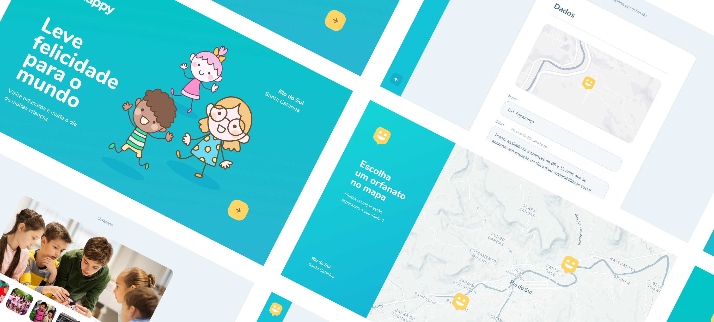

# Happy - Website



## Tabela de conteúdo
- [Sobre o projeto](#sobre-o-projeto)
- [Tecnologias usadas](#tecnologias-usadas)
- [Primeiros passos](#primeiros-passos)
  - [Pré-requisitos](#pré-requisitos)
  - [Instalação](#instalação)
- [Uso](#uso)
- [Contato](#contato)

## Sobre o projeto

Happy é um website que permite que pessoas encontrem orfanatos que estão disponíveis a receber visitas na região. Com o Happy é possível criar orfanatos, adicioná-los no mapa e permitir que outros encontrem.

O projeto possui uma API que pode ser encontrada [aqui](https://github.com/leonardonegrao/happy-api/) e uma versão [mobile](https://github.com/leonardonegrao/happy-mobile).

O design e estrutura do código foi feito pela equipe da [Rocketseat](https://github.com/Rocketseat) para a terceira edição da Next Level Week.

## Tecnologias usadas

- [TypeScript](https://github.com/microsoft/TypeScript/)
- [ReactJS](https://github.com/facebook/react/)
- [React Leaflet](https://github.com/PaulLeCam/react-leaflet)
- [Mapbox](https://www.mapbox.com/)
- [Axios](https://github.com/axios/axios)

## Primeiros passos

Para rodar a aplicação, siga os passos a seguir.

### Pré-requisitos

É necessário ter o NodeJS e o NPM (ou Yarn) instalados na máquina para rodar a aplicação. Para instalar essas dependências, siga as instruções de seus sites:

* [NodeJS and NPM](https://nodejs.org/en/download/)
* [Yarn (Opcional)](https://yarnpkg.com/)

Além disso, também é necessário ter a API executando, para ver mais sobre a API acesse o [repositório](https://github.com/leonardonegrao/happy-api/).

### Instalação

1. Clone o repositório
```sh
git clone https://github.com/leonardonegrao/happy-web.git
```
2. Instale as dependências do projeto

* Com NPM:
```sh
npm install
```

* Com Yarn:
```sh
yarn
```

## Uso

A aplicação pode ser iniciada pelo comando:

* Com NPM:
```sh
npm run start
```

* Com Yarn:
```sh
yarn start
```

Quando o script for concluído, a aplicação será aberta no navegador padrão e já pode ser utilizada.

## Contato

[](https://linkedin.com/in/leonardonegrão)

Leonardo Negrão - [leonardolnegrao@gmail.com](mailto:leonardolnegrao@gmail.com)

Link do projeto: [https://github.com/leonardonegrao/happy-web](https://github.com/leonardonegrao/happy-web)
